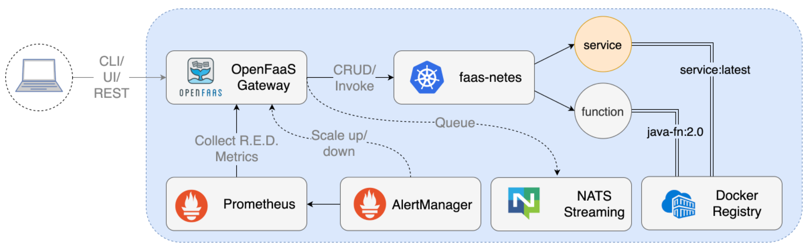

# OpenFaas | Serverless | Speed up business transformations made simple 
## Introduction
- When application developers struggles to create production grade microservice. It is a key responsible of Architect to bring in a platform that offloads the responsibility
of managing non-functional requirements like traffic management, security, deployment/releases, observability etc.
- Serverless is a concept where implementation goes a layer under where the only responsibility of developers is to focus on developing behavior using functions. And rest of non-functional requirements are taken care by serverless framework. 
- Openfaas makes it easy for developers to deploy event-driven functions and microservices to Kubernetes without repetitive, boiler-plate coding. Package your code or an existing binary in a Docker image to get a highly scalable endpoint with auto-scaling and metrics.
    

## Architecture Diagram
- Simple but usable functions (i.e. small, useable building blocks).
- Scales with usage (servers are autoscaled on the user’s behalf).
- Built-in availability and fault tolerance (i.e. NoOps).



## PLONK Description
### Prometheus 
- Metrics and time-series
### Linkerd 
- Service mesh
### OpenFaaS 
- Management and auto-scaling of compute - PaaS/FaaS
### NATS 
- Asynchronous message bus / queue
### Kubernetes 
- Declarative, extensible, scale-out, self-healing clustering

## Use Cases
- Event-driven data processing.
- Web applications.
- Mobile and Internet-of-Things applications.
- Application ecosystems.
- Event workflows.

## Why openfaas?
- As compared to its alternatives, I find adoption rate of Openfaas is highest with more than 20k stars. That results into huge community contribution.
- Easy of debugging.
- Seamless integration with KEDA (Kubernetes-based Event Driven Autoscaling) [https://github.com/kedacore/keda]
- Wide range of language support.

```
NAME                     SOURCE             DESCRIPTION
csharp                   openfaas           Classic C# template
dockerfile               openfaas           Classic Dockerfile template
go                       openfaas           Classic Golang template
java8                    openfaas           Java 8 template
java11                   openfaas           Java 11 template
java11-vert-x            openfaas           Java 11 Vert.x template
node14                   openfaas           HTTP-based Node 14 template
node12                   openfaas           HTTP-based Node 12 template
node                     openfaas           Classic NodeJS 8 template
php7                     openfaas           Classic PHP 7 template
python                   openfaas           Classic Python 2.7 template
python3                  openfaas           Classic Python 3.6 template
python3-dlrs             intel              Deep Learning Reference Stack v0.4 for ML workloads
ruby                     openfaas           Classic Ruby 2.5 template
ruby-http                openfaas           Ruby 2.4 HTTP template
python27-flask           openfaas           Python 2.7 Flask template
python3-flask            openfaas           Python 3.7 Flask template
python3-flask-debian     openfaas           Python 3.7 Flask template based on Debian
python3-http             openfaas           Python 3.7 with Flask and HTTP
python3-http-debian      openfaas           Python 3.7 with Flask and HTTP based on Debian
golang-http              openfaas           Golang HTTP template
golang-middleware        openfaas           Golang Middleware template
python3-debian           openfaas           Python 3 Debian template
powershell-template      openfaas-incubator Powershell Core Ubuntu:16.04 template
powershell-http-template openfaas-incubator Powershell Core HTTP Ubuntu:16.04 template
rust                     booyaa             Rust template
crystal                  tpei               Crystal template
csharp-httprequest       distantcam         C# HTTP template
csharp-kestrel           burtonr            C# Kestrel HTTP template
vertx-native             pmlopes            Eclipse Vert.x native image template
swift                    affix              Swift 4.2 Template
lua53                    affix              Lua 5.3 Template
vala                     affix              Vala Template
vala-http                affix              Non-Forking Vala Template
quarkus-native           pmlopes            Quarkus.io native image template
perl-alpine              tmiklas            Perl language template based on Alpine image
crystal-http             koffeinfrei        Crystal HTTP template
rust-http                openfaas-incubator Rust HTTP template
bash-streaming           openfaas-incubator Bash Streaming template
cobol                    devries            COBOL Template
```


## Alternatives
- Kubeless [https://kubeless.io/]
- Knative [https://knative.dev/docs/]
- Apache OpenWhisk [https://openwhisk.apache.org/]
- Fission [https://fission.io/]

## System Requirements
### Kind (Kubernetes In Docker)
- https://kind.sigs.k8s.io/
### Binary Installation | faas-cli
- https://docs.openfaas.com/cli/install/

## Setup Openfaas
### Helm Chart
- https://github.com/openfaas/faas-netes/tree/master/chart/openfaas

### Edited values.yaml to make it run on Kind
- values.yaml

## Create a function
- I'm writing this function in Golang for it being comfort choice of programming language after Java.
### Bootstrap Openfaas project
```
faas-cli new go-app --lang=golang-http
``` 
### Implement controller 
- go-app/handler.go
### Unit Test
- go-app/handler_test.go

```
go test
```


## Deployment
### Build an image into the local Docker library
```
faas-cli build -f go-app.yml
```
### Push that image to a remote container registry
```
faas-cli push -f go-app.yml
```
### Deploy your function into a cluster
```
faas-cli deploy -f go-app.yml
```


## Testing
### Acceptance Testing
#### Setup
- https://github.com/cucumber/godog
- https://github.com/gkushang/cucumber-html-reporter
#### Script
- cd godogs/
- godog features/*
- godog features/* --format=cucumber > cucumber.json
- npm install cucumber-html-reporter --save-dev
- node index.js
- rm -rf node_modules/ package*
#### Output
- 

### Performance Testing
#### Setup
- https://github.com/rakyll/hey
#### Script
- hey -z 10s -m POST http://127.0.0.1:8001/function/go-app -d {"name":"testUser","age":18}
#### Output
```
Summary:
  Total:	10.0556 secs
  Slowest:	0.4814 secs
  Fastest:	0.0147 secs
  Average:	0.1410 secs
  Requests/sec:	353.4352

  Total data:	67526 bytes
  Size/request:	19 bytes

Response time histogram:
  0.015 [1]	|
  0.061 [233]	|■■■■■■■■■
  0.108 [1045]	|■■■■■■■■■■■■■■■■■■■■■■■■■■■■■■■■■■■■■■■■
  0.155 [1032]	|■■■■■■■■■■■■■■■■■■■■■■■■■■■■■■■■■■■■■■■■
  0.201 [665]	|■■■■■■■■■■■■■■■■■■■■■■■■■
  0.248 [313]	|■■■■■■■■■■■■
  0.295 [165]	|■■■■■■
  0.341 [52]	|■■
  0.388 [33]	|■
  0.435 [12]	|
  0.481 [3]	|


Latency distribution:
  10% in 0.0696 secs
  25% in 0.0925 secs
  50% in 0.1277 secs
  75% in 0.1769 secs
  90% in 0.2312 secs
  95% in 0.2660 secs
  99% in 0.3642 secs

Details (average, fastest, slowest):
  DNS+dialup:	0.0000 secs, 0.0147 secs, 0.4814 secs
  DNS-lookup:	0.0000 secs, 0.0000 secs, 0.0000 secs
  req write:	0.0000 secs, 0.0000 secs, 0.0003 secs
  resp wait:	0.1408 secs, 0.0146 secs, 0.4813 secs
  resp read:	0.0000 secs, 0.0000 secs, 0.0004 secs

Status code distribution:
  [200]	3554 responses

```